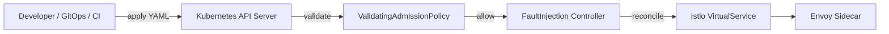
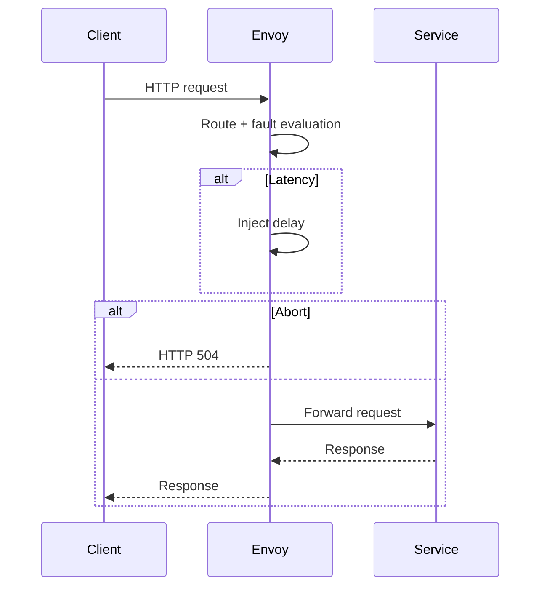

# Network Fault Injector

[](https://go.dev/) [](https://kubernetes.io/) [](https://istio.io/) [](LICENSE) [](#) 

---

## Table of Contents

- [Network Fault Injector](#network-fault-injector)
  - [Table of Contents](#table-of-contents)
  - [Declarative HTTP Chaos for Kubernetes (Istio / Envoy)\*\*](#declarative-http-chaos-for-kubernetes-istio--envoy)
  - [✨ What is this?](#-what-is-this)
  - [🔑 Why this exists](#-why-this-exists)
  - [🧠 Architecture](#-architecture)
    - [Control plane](#control-plane)
    - [Runtime execution](#runtime-execution)
  - [🚦 Supported faults](#-supported-faults)
    - [Directions](#directions)
    - [Targeting](#targeting)
  - [📄 Example: INBOUND fault](#-example-inbound-fault)
  - [🔐 Security Model](#-security-model)
    - [1️⃣ RBAC model](#1️⃣-rbac-model)
      - [Principle: *Teams own chaos in their namespace only*](#principle-teams-own-chaos-in-their-namespace-only)
    - [2️⃣ Admission control (policy \> trust)](#2️⃣-admission-control-policy--trust)
    - [3️⃣ Tenancy \& isolation](#3️⃣-tenancy--isolation)
  - [🧱 RBAC + Admission Policies per Environment](#-rbac--admission-policies-per-environment)
    - [DEV](#dev)
    - [STAGING](#staging)
    - [PROD](#prod)
  - [🛡️ Security Threat Model](#️-security-threat-model)
    - [Threats \& mitigations](#threats--mitigations)
    - [Explicit non-goals](#explicit-non-goals)
  - [🏢 How to Adopt This in an Org](#-how-to-adopt-this-in-an-org)
    - [Phase 0 — Positioning](#phase-0--positioning)
    - [Phase 1 — Platform ownership](#phase-1--platform-ownership)
    - [Phase 2 — Define guardrails](#phase-2--define-guardrails)
    - [Phase 3 — GitOps integration](#phase-3--gitops-integration)
    - [Phase 4 — Start in staging](#phase-4--start-in-staging)
    - [Phase 5 — Production (opt-in)](#phase-5--production-opt-in)
    - [Phase 6 — Normalize chaos](#phase-6--normalize-chaos)
  - [how to run locally using Lima + k3s](#how-to-run-locally-using-lima--k3s)
    - [Tools](#tools)
    - [1) Start k3s via Lima](#1-start-k3s-via-lima)
    - [2) Disable Traefik (no restart)](#2-disable-traefik-no-restart)
    - [3) Install Istio](#3-install-istio)
    - [4) Create demo namespace and enable sidecar injection](#4-create-demo-namespace-and-enable-sidecar-injection)
    - [5) Deploy demo apps (httpbin1, httpbin2, curl-client)](#5-deploy-demo-apps-httpbin1-httpbin2-curl-client)
    - [6) Apply VirtualServices](#6-apply-virtualservices)
    - [7) Install CRDs](#7-install-crds)
    - [8) Install Admission Control (ValidatingAdmissionPolicy)](#8-install-admission-control-validatingadmissionpolicy)
    - [9) Build and deploy the operator (local dev image)](#9-build-and-deploy-the-operator-local-dev-image)
      - [Build image locally](#build-image-locally)
      - [Import image into the Lima VM/containerd](#import-image-into-the-lima-vmcontainerd)
      - [Deploy operator](#deploy-operator)
    - [10) Apply the fault scenario](#10-apply-the-fault-scenario)
    - [11) Testing](#11-testing)
    - [12) Cleanup](#12-cleanup)
      - [Remove the experiment](#remove-the-experiment)
      - [Remove operator](#remove-operator)
      - [Remove admission policy](#remove-admission-policy)
      - [Remove CRDs](#remove-crds)
      - [Remove demo apps](#remove-demo-apps)
      - [Optional: uninstall Istio](#optional-uninstall-istio)
      - [Optional: stop/delete the Lima VM](#optional-stopdelete-the-lima-vm)
    - [Troubleshooting](#troubleshooting)
      - [Admission policy rejects your FaultInjection](#admission-policy-rejects-your-faultinjection)
      - [Outbound faults not applying](#outbound-faults-not-applying)
  - [how to run on k8s cluster](#how-to-run-on-k8s-cluster)
    - [0) Prereqs (cluster)](#0-prereqs-cluster)
    - [Option A (recommended): Build, push, install CRDs, deploy controller](#option-a-recommended-build-push-install-crds-deploy-controller)
      - [1) Build + push controller image](#1-build--push-controller-image)
      - [2) Install CRDs](#2-install-crds)
      - [3) Install admission policy (guardrails)](#3-install-admission-policy-guardrails)
      - [4) Deploy the controller](#4-deploy-the-controller)
    - [Option B: Install from the generated YAML bundle (dist/install.yaml)](#option-b-install-from-the-generated-yaml-bundle-distinstallyaml)
    - [1) Build the installer bundle](#1-build-the-installer-bundle)
      - [2) Apply the bundle](#2-apply-the-bundle)
    - [Option C: Deploy from manifests (kustomize)](#option-c-deploy-from-manifests-kustomize)
    - [After install: enable a target namespace](#after-install-enable-a-target-namespace)
      - [1) Label namespace for sidecar injection](#1-label-namespace-for-sidecar-injection)
      - [2) Ensure the service has a VirtualService “bucket” to attach faults to](#2-ensure-the-service-has-a-virtualservice-bucket-to-attach-faults-to)
    - [Apply a FaultInjection](#apply-a-faultinjection)
      - [Troubleshooting quick checks](#troubleshooting-quick-checks)
        - [Controller logs](#controller-logs)
        - [Admission policy failures](#admission-policy-failures)
        - [Istio sidecars](#istio-sidecars)
  - [📜 License](#-license)

---

## Declarative HTTP Chaos for Kubernetes (Istio / Envoy)**

A **GitOps-first chaos engineering system** for Kubernetes that enables **deterministic, request-level HTTP fault injection** using **Istio / Envoy**, enforced by **Kubernetes admission control**.

> Built for **shared clusters**, **auditable chaos**, and **production-faithful testing** — without packet-level hacks, agents, or privileged access.

---

## ✨ What is this?

**Network Fault Injector** lets teams declare controlled failure scenarios as Kubernetes resources:

- Latency injection
- Deterministic “timeouts” (HTTP aborts)
- Inbound *and* outbound traffic targeting
- Strict blast-radius and semantic validation

Everything is expressed via a custom:

```text
FaultInjection (CRD)
```

…and enforced **before execution** using **CEL-based `ValidatingAdmissionPolicy`**.

---

## 🔑 Why this exists

Traditional chaos tooling often suffers from one or more of:

- Non-determinism (iptables, netem, tc)
- Unsafe primitives in shared clusters
- High operational overhead (agents, privileges)
- Poor auditability

This project takes a **policy-first, request-level** approach.

| Principle            | How it’s enforced            |
| -------------------- | ---------------------------- |
| Deterministic        | Envoy HTTP faults            |
| Safe by default      | Admission control            |
| GitOps-native        | Declarative CRDs             |
| Shared-cluster ready | Namespace + policy isolation |
| Observable           | Native Envoy metrics         |

---

## 🧠 Architecture

### Control plane



---

### Runtime execution



---

## 🚦 Supported faults

- `HTTP_LATENCY` – fixed delay
- `HTTP_ABORT` – deterministic abort (e.g. 504)

### Directions

- **INBOUND**: client → service
- **OUTBOUND**: pod → destination (`gateways: ["mesh"]`)

### Targeting

- URI prefix / exact
- Optional headers
- Source pod labels (outbound)
- Destination hosts
- Percentage-based traffic

---

## 📄 Example: INBOUND fault

```yaml
apiVersion: chaos.sghaida.io/v1alpha1
kind: FaultInjection
metadata:
  name: inbound-latency
spec:
  blastRadius:
    durationSeconds: 300
    maxTrafficPercent: 50
  actions:
    meshFaults:
      - name: delay-orders
        direction: INBOUND
        virtualServiceRef:
          name: orders
        uriPrefix: /api/orders
        delay:
          fixedDelay: 2s
        percentage: 30
```

---

## 🔐 Security Model

Security is enforced at **three layers**:

1. **RBAC (who can act)**
2. **Admission policies (what is allowed)**
3. **Runtime blast-radius containment**

---

### 1️⃣ RBAC model

#### Principle: *Teams own chaos in their namespace only*

```yaml
apiVersion: rbac.authorization.k8s.io/v1
kind: Role
metadata:
  name: faultinjection-editor
  namespace: demo
rules:
- apiGroups: ["chaos.sghaida.io"]
  resources: ["faultinjections"]
  verbs: ["get", "list", "watch", "create", "update", "delete"]
```

Bound via `RoleBinding` to app teams.

🚫 App teams **cannot**:

- Modify admission policies
- Touch other namespaces
- Modify VirtualServices directly (optional)

---

### 2️⃣ Admission control (policy > trust)

Even cluster-admins are constrained unless policies are removed.

Enforced at CREATE / UPDATE:

- Required blast radius
- Max duration / percentage
- Semantic correctness
- Mandatory selectors
- Direction correctness
- No unsafe routing

If rejected → **experiment never runs**.

---

### 3️⃣ Tenancy & isolation

| Dimension | Guarantee                       |
| --------- | ------------------------------- |
| Namespace | Faults apply only where created |
| Traffic   | Limited to declared routes      |
| Time      | Auto-expiry                     |
| Scope     | No node / pod / kernel mutation |

---

## 🧱 RBAC + Admission Policies per Environment

### DEV

**Goal:** Learning & experimentation

RBAC:

- Namespace-scoped create/update/delete

Admission:

- Max delay: 5s
- Max traffic: 100%
- Max duration: 30m

```yaml
spec.blastRadius.durationSeconds <= 1800
```

---

### STAGING

**Goal:** Pre-prod validation

RBAC:

- Namespace-scoped
- Requires team approval

Admission:

- Max delay: 3s
- Max traffic: 50%
- Max duration: 15m

Optional:

```yaml
metadata.annotations["chaos.reviewed"] == "true"
```

---

### PROD

**Goal:** Controlled, opt-in chaos

RBAC:

- Read/write only for approved groups

Admission:

- Max delay: 2s
- Max traffic: 30%
- Max duration: 10m
- Required approval annotation

```yaml
metadata.annotations["chaos.approved-by"].exists()
```

---

## 🛡️ Security Threat Model

### Threats & mitigations

| Threat                 | Mitigation            |
| ---------------------- | --------------------- |
| Abuse to DoS prod      | Admission caps + RBAC |
| Accidental wide blast  | Mandatory percentages |
| Long-running chaos     | Forced expiry         |
| Cross-namespace impact | Namespace isolation   |
| Privilege escalation   | No privileged access  |
| Silent failures        | Envoy metrics         |

---

### Explicit non-goals

❌ Packet corruption
❌ Kernel faults
❌ Node failures
❌ TCP-level chaos

(Use Chaos Mesh / FIS if you need those.)

---

## 🏢 How to Adopt This in an Org

### Phase 0 — Positioning

Frame as **controlled failure injection**, not “breaking prod”.

---

### Phase 1 — Platform ownership

Platform team owns:

- CRDs
- Admission policies
- Controller lifecycle

---

### Phase 2 — Define guardrails

Hard-code limits in policy, not docs.

---

### Phase 3 — GitOps integration

```bash
service-repo/
  chaos/
    latency.yaml
    timeout.yaml
```

PR → review → merge → chaos.

---

### Phase 4 — Start in staging

Validate retries, timeouts, fallbacks.

---

### Phase 5 — Production (opt-in)

Short duration, low percentage, approval required.

---

### Phase 6 — Normalize chaos

- Replay incidents
- Validate SLOs
- Test before launches

> “If you can’t describe how it fails, you can’t ship it.”

---

## how to run locally using Lima + k3s

### Tools

```bash
brew install lima kubectl istioctl make docker
```

This README uses:

- **Lima** (VM)
- **k3s** (Kubernetes)
- **Istio** (Envoy data plane)

---

### 1) Start k3s via Lima

```bash
limactl start template://k3s
```

Configure kubeconfig:

```bash
export KUBECONFIG=$HOME/.lima/k3s/copied-from-guest/kubeconfig.yaml
kubectl get nodes
```

Expected: node is `Ready`.

---

### 2) Disable Traefik (no restart)

k3s installs Traefik via a HelmChart CRD. Remove it safely at runtime:

```bash
kubectl -n kube-system delete helmchart traefik traefik-crd --ignore-not-found
kubectl get pods -n kube-system | grep traefik || echo "Traefik removed"
```

---

### 3) Install Istio

```bash
istioctl install -y --set profile=default
kubectl get pods -n istio-system
```

---

### 4) Create demo namespace and enable sidecar injection

```bash
kubectl create namespace demo --dry-run=client -o yaml | kubectl apply -f -
kubectl label namespace demo istio-injection=enabled --overwrite
```

---

### 5) Deploy demo apps (httpbin1, httpbin2, curl-client)

Apply the manifests (adjust path if needed):

```bash
kubectl apply -n demo -f resources/apps.yaml
```

Wait for readiness:

```bash
kubectl -n demo rollout status deploy/httpbin1
kubectl -n demo rollout status deploy/httpbin2
kubectl -n demo get pod curl-client
```

---

### 6) Apply VirtualServices

Apply the VirtualServices that define the routing buckets used by the chaos rules:

```bash
kubectl apply -n demo -f resources/vs.yaml
```

Notes:

- **INBOUND** uses `VirtualService httpbin1`
- **OUTBOUND** uses a single `VirtualService httpbin2` with `gateways: ["mesh"]`
  to avoid non-deterministic merge ordering when multiple VirtualServices target the same host.

Verify:

```bash
kubectl -n demo get virtualservice
kubectl -n demo describe virtualservice httpbin2 | sed -n '1,120p'
```

---

### 7) Install CRDs

Install the custom FaultInjection CRD:

```bash
kubectl apply -f config/crd/bases/chaos.sghaida.io_faultinjections.yaml
kubectl get crds | grep -i faultinjection
```

---

### 8) Install Admission Control (ValidatingAdmissionPolicy)

This repo uses **CEL-based ValidatingAdmissionPolicy** to enforce guardrails.

Apply the policy + binding:

```bash
kubectl apply -f resources/validating-policy.yaml
kubectl get validatingadmissionpolicy faultinjection.chaos.sghaida.io
kubectl get validatingadmissionpolicybinding faultinjection.chaos.sghaida.io
```

What it enforces (high-level):

- Required `spec.blastRadius` + at least one `actions.meshFaults`
- Unique action names
- Percent bounds (`0..100`) and must not exceed `blastRadius.maxTrafficPercent`
- Every route must have `uriPrefix` or `uriExact`
- Type semantics:

  - `HTTP_LATENCY` requires `delay` and forbids `abort`
  - `HTTP_ABORT` requires `abort` and forbids `delay`
- Direction semantics:

  - `INBOUND` requires `virtualServiceRef.name` and forbids `destinationHosts` and `sourceSelector`
  - `OUTBOUND` requires `destinationHosts` and `sourceSelector.matchLabels`, forbids `virtualServiceRef`
- Delay/timeout bounds capped at 300s (5m) unless updated

---

### 9) Build and deploy the operator (local dev image)

#### Build image locally

```bash
make docker-build IMG=fi-operator:dev
```

#### Import image into the Lima VM/containerd

Build in host Docker, then import into k3s containerd:

```bash
docker save fi-operator:dev -o fi-operator.tar
limactl shell k3s sudo k3s ctr images import - < fi-operator.tar
```

#### Deploy operator

```bash
make deploy IMG=fi-operator:dev
```

Verify operator is running:

```bash
kubectl -n chaos-system get pods 2>/dev/null || true
kubectl get pods -A | grep -E "fi-operator|fault|chaos" || true
```

> Namespace depends on your deployment manifests (commonly `chaos-system`).
> Use `kubectl get pods -A | grep fi-operator` to locate it.

---

### 10) Apply the fault scenario

Apply your `FaultInjection` manifest:

```bash
kubectl apply -f resources/fi-scenarios.yaml
kubectl -n demo get faultinjection
kubectl -n demo describe faultinjection fi-inbound-outbound-latency-timeout
```

Scenario overview:

- INBOUND latency on `/anything/vendors/` for `httpbin1`
- INBOUND abort (504) when header `x-chaos-mode: timeout` for `httpbin1`
- OUTBOUND latency on `/anything/vendors/` from pods labeled `app=curl-client` to host `httpbin2`
- OUTBOUND abort (504) when header `x-chaos-mode: timeout` for the same source/destination

Blast radius:

- Duration: `600s`
- Max traffic: `100%`

---

### 11) Testing

Run the full test suite from the `curl-client` pod.
This asserts:

- control paths are fast (no fault)
- abort paths return **504**
- delay paths take **~2s**
- non-matching paths remain fast

```bash
kubectl -n demo exec curl-client -- sh -lc '
set -eu

ok()   { printf "✅ %s\n" "$1"; }
fail() { printf "❌ %s\n" "$1"; exit 1; }

run() {
  name="$1"; shift
  out="$(sh -lc "$*" 2>/dev/null || true)"
  printf "%s\n" "$out"
}

assert_code() {
  name="$1"; want="$2"; out="$3"
  code="$(printf "%s" "$out" | sed -n "s/.*code=\\([0-9][0-9][0-9]\\).*/\\1/p" | tail -n1)"
  [ "$code" = "$want" ] && ok "$name (code=$code)" || fail "$name expected code=$want got code=${code:-?}"
}

assert_ge() {
  name="$1"; min="$2"; out="$3"
  total="$(printf "%s" "$out" | sed -n "s/.*total=\\([0-9.]*\\).*/\\1/p" | tail -n1)"
  awk -v t="$total" -v m="$min" "BEGIN{ exit !(t>=m) }" && ok "$name (total=$total>=${min})" || fail "$name expected total>=${min} got total=${total:-?}"
}

assert_lt() {
  name="$1"; max="$2"; out="$3"
  total="$(printf "%s" "$out" | sed -n "s/.*total=\\([0-9.]*\\).*/\\1/p" | tail -n1)"
  awk -v t="$total" -v m="$max" "BEGIN{ exit !(t<m) }" && ok "$name (total=$total<${max})" || fail "$name expected total<${max} got total=${total:-?}"
}

echo "=== OUTBOUND ==="

o1=$(run "OUTBOUND CTRL"  "curl -s -o /dev/null -w \"OUTBOUND CTRL  code=%{http_code} total=%{time_total}\\n\" http://httpbin2:8000/anything/test")
printf "%s\n" "$o1"
assert_code "OUTBOUND CTRL"  "200" "$o1"
assert_lt   "OUTBOUND CTRL fast" "0.5" "$o1"

o2=$(run "OUTBOUND ABORT" "curl -s -o /dev/null -w \"OUTBOUND ABORT code=%{http_code} total=%{time_total}\\n\" -H \"x-chaos-mode: timeout\" http://httpbin2:8000/anything/test")
printf "%s\n" "$o2"
assert_code "OUTBOUND ABORT" "504" "$o2"
assert_lt   "OUTBOUND ABORT fast" "0.5" "$o2"

o3=$(run "OUTBOUND DELAY" "curl -s -o /dev/null -w \"OUTBOUND DELAY code=%{http_code} total=%{time_total}\\n\" http://httpbin2:8000/anything/vendors/test")
printf "%s\n" "$o3"
assert_code "OUTBOUND DELAY" "200" "$o3"
assert_ge   "OUTBOUND DELAY >=2s" "1.8" "$o3"

o4=$(run "OUTBOUND NOHIT" "curl -s -o /dev/null -w \"OUTBOUND NOHIT code=%{http_code} total=%{time_total}\\n\" http://httpbin2:8000/anything/other/test")
printf "%s\n" "$o4"
assert_code "OUTBOUND NOHIT" "200" "$o4"
assert_lt   "OUTBOUND NOHIT fast" "0.5" "$o4"

echo "=== INBOUND ==="

i1=$(run "INBOUND CTRL"  "curl -s -o /dev/null -w \"INBOUND CTRL  code=%{http_code} total=%{time_total}\\n\" http://httpbin1:8000/anything/test")
printf "%s\n" "$i1"
assert_code "INBOUND CTRL"  "200" "$i1"
assert_lt   "INBOUND CTRL fast" "0.5" "$i1"

i2=$(run "INBOUND DELAY" "curl -s -o /dev/null -w \"INBOUND DELAY code=%{http_code} total=%{time_total}\\n\" http://httpbin1:8000/anything/vendors/test")
printf "%s\n" "$i2"
assert_code "INBOUND DELAY" "200" "$i2"
assert_ge   "INBOUND DELAY >=2s" "1.8" "$i2"

i3=$(run "INBOUND ABORT" "curl -s -o /dev/null -w \"INBOUND ABORT code=%{http_code} total=%{time_total}\\n\" -H \"x-chaos-mode: timeout\" http://httpbin1:8000/anything/test")
printf "%s\n" "$i3"
assert_code "INBOUND ABORT" "504" "$i3"
assert_lt   "INBOUND ABORT fast" "0.5" "$i3"

echo "=== ENVOY STATS (smoke) ==="
curl -s localhost:15000/stats | grep -F "httpbin2.demo.svc.cluster.local" | head -n 5 || true

echo "✅ ALL TESTS PASSED"
'
```

---

### 12) Cleanup

#### Remove the experiment

```bash
kubectl -n demo delete faultinjection fi-inbound-outbound-latency-timeout --ignore-not-found
```

#### Remove operator

```bash
make undeploy || true
```

#### Remove admission policy

```bash
kubectl delete -f resources/validating-policy.yaml --ignore-not-found
```

#### Remove CRDs

```bash
kubectl delete -f config/crd/bases/validating-policy.yaml --ignore-not-found
```

#### Remove demo apps

```bash
kubectl delete namespace demo --ignore-not-found
```

#### Optional: uninstall Istio

```bash
istioctl uninstall -y
kubectl delete namespace istio-system --ignore-not-found
```

#### Optional: stop/delete the Lima VM

```bash
limactl stop k3s
# limactl delete k3s
```

---

### Troubleshooting

#### Admission policy rejects your FaultInjection

Use:

```bash
kubectl apply -f resources/fi-scenarios.yaml --dry-run=server
```

The error message will come from `ValidatingAdmissionPolicy` and should point to the violated rule.

#### Outbound faults not applying

Common causes:

- `httpbin2` VirtualService missing `gateways: ["mesh"]`
- Outbound rules split across multiple VirtualServices (merge ordering issues)
- Source pod missing labels required by `sourceSelector.matchLabels`

Verify curl-client labels:

```bash
kubectl -n demo get pod curl-client --show-labels
```

Verify outbound VirtualService is in effect:

```bash
kubectl -n demo get virtualservice httpbin2 -o yaml | sed -n '1,200p'
```

## how to run on k8s cluster

Here’s the **clean “deploy on a real cluster”** path (non-local, registry image). I’ll include both **raw YAML/kustomize** and **bundle** options, plus the **minimum Istio + policy** prerequisites.

---

### 0) Prereqs (cluster)

- Kubernetes v1.27+ (or any version that supports `ValidatingAdmissionPolicy`)
- Istio installed in the cluster (Envoy sidecars running)
- `kubectl`, `make`, `docker`
- A container registry your cluster can pull from

> If you don’t have Istio yet: install it first.

```bash
istioctl install -y --set profile=default
```

---

### Option A (recommended): Build, push, install CRDs, deploy controller

#### 1) Build + push controller image

```bash
export IMG=<registry>/fi-operator:<tag>

make docker-build docker-push IMG=$IMG
```

#### 2) Install CRDs

```bash
make install
```

Verify:

```bash
kubectl get crd | grep -i faultinjection
```

#### 3) Install admission policy (guardrails)

```bash
kubectl apply -f resources/validating-policy.yaml
kubectl get validatingadmissionpolicy
kubectl get validatingadmissionpolicybinding
```

#### 4) Deploy the controller

```bash
make deploy IMG=$IMG
```

Verify it’s running:

```bash
kubectl get pods -A | grep -E "fi-operator|chaos" || true
```

---

### Option B: Install from the generated YAML bundle (dist/install.yaml)

### 1) Build the installer bundle

```bash
export IMG=<registry>/fi-operator:<tag>

make docker-build docker-push IMG=$IMG
make build-installer IMG=$IMG
```

#### 2) Apply the bundle

```bash
kubectl apply -f dist/install.yaml
```

Verify:

```bash
kubectl get pods -A | grep -E "fi-operator|chaos" || true
kubectl get crd | grep -i faultinjection
```

> This is the easiest “single file” install method for other teams.

---

### Option C: Deploy from manifests (kustomize)

If your repo has the standard kubebuilder layout, you can:

```bash
export IMG=<registry>/fi-operator:<tag>
kustomize build config/default | kubectl apply -f -
```

Or (often preferred) patch the image in `kustomization.yaml` and apply.

---

### After install: enable a target namespace

#### 1) Label namespace for sidecar injection

```bash
kubectl label namespace <ns> istio-injection=enabled --overwrite
```

#### 2) Ensure the service has a VirtualService “bucket” to attach faults to

You need your base VirtualService routing in place (the controller will add fault rules into those routes).

---

### Apply a FaultInjection

```bash
kubectl -n <ns> apply -f <your-fi.yaml>
kubectl -n <ns> get faultinjection
kubectl -n <ns> describe faultinjection <name>
```

Dry-run admission check (very useful in CI):

```bash
kubectl -n <ns> apply -f <your-fi.yaml> --dry-run=server
```

---

#### Troubleshooting quick checks

##### Controller logs

```bash
kubectl get pods -A | grep fi-operator
kubectl -n <operator-namespace> logs deploy/fi-operator -f
```

##### Admission policy failures

```bash
kubectl -n <ns> apply -f <your-fi.yaml> --dry-run=server
```

##### Istio sidecars

```bash
kubectl -n <ns> get pods
kubectl -n <ns> describe pod <pod> | grep -i istio-proxy
```

## 📜 License

Apache License 2.0 © 2026
